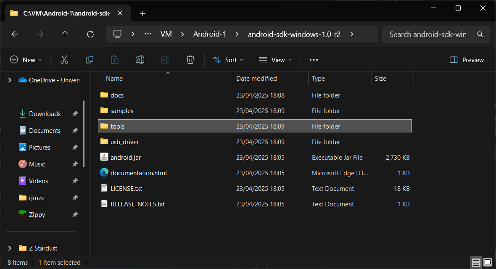
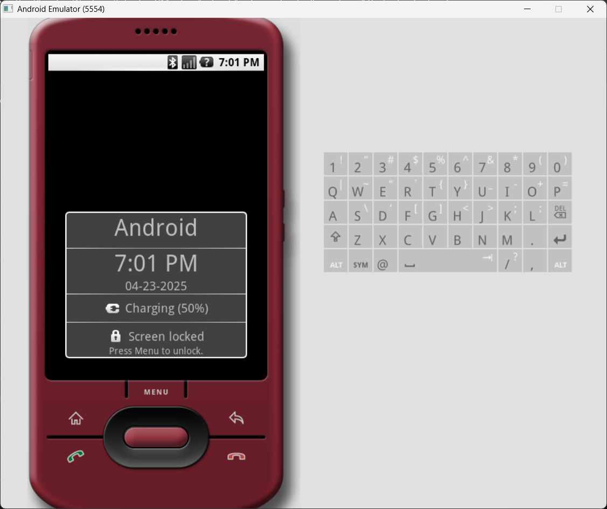
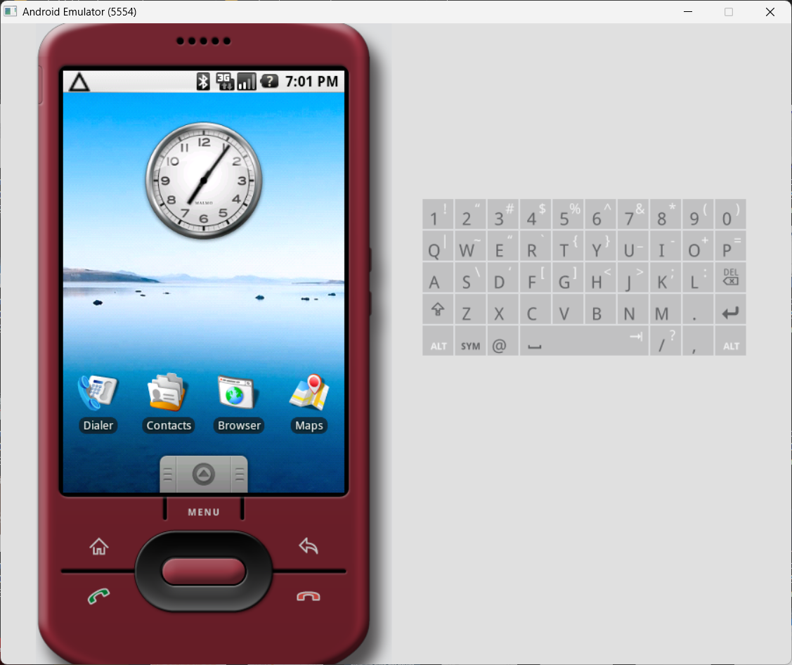

# Virtualización Android 1.0

Para la virtualización de Android 1.0 haremos uso del SDK 1.0 de Android, utilizado principalmente para el desarrollo de aplicaciones para este SO. Este kit incluye una máquina virtual de Android 1.0, la cual usaremos para este test y se puede encontrar <a href="https://archive.org/details/android-sdk-1.0_r2"> **aquí desde archive.org**</a>.

Para realizar este ejemplo, se proveen scripts para la realización de este test.
### 1. Extrayendo el SDK
Una vez hayamos descargadoel SDK para nuestro SO, extraemos el archivo `.zip` obtenido en un directorio de nuestra preferencia. Estos nos dará una carpeta llamada `android-sdk-windows-1.0_r2` Dentro de este tendremos una carpeta llamada `tools`, la cual contiene el ejecutable o binario del emulador.

### 2. Ejecutando el emulador
Entramos a la carpeta y procedemos a ejecutar el archivo `emulator.exe` en Windows o solamente `emulator` en Linux. Es posible que el SO nos dé una advertencia, pero como toda advertencia la vamos a ignorar. 

Una vez hecho lo anterior, podremos ver el emulador en acción

Presionamos la tecla _MENU_ justo debajo de la pantalla para desbloquear y poder explorar un poco.

