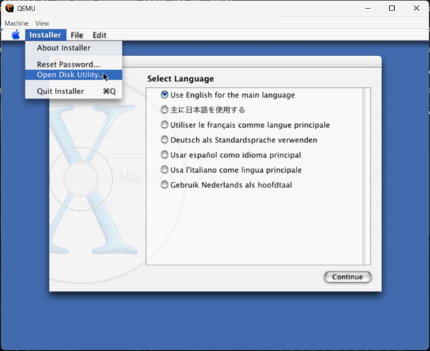

# Virtualización de MacOS X 10.0

Para la evidencia de esta virtualización habremos guardado todos los comando usados en el script en bash: ``cheetah.sh``, que se encuentra en el mismo directorio que este archivo. 
Por simplificación supondremos que la imagen ya se encuentra descargada y todo se hará dentro del directorio __``~/vm``__

1. __Creando el disco__
    Crearemos el disco de 10 GB en el que instalaremos el SO con el comando
    `` qemu-img create -f vmdk ~/vm/Cheetah.vmdk 10G ``
    Se recomienda verificar la creción del mismo posteriormente. El tamaño es solo una sugerencia
2. __Iniciando la máquina virtual__
    Para este paso se recomienda que la imagen se encuentre en el directorio y procedemos con el comando
    ``qemu-system-ppc -L pc-bios -boot d -cdrom MacOSCheetah.iso -hda Cheetah.vmdk -m 1024``
    El 1024 se refiere a la memoria en MB que usará, aunque esto es solo una sugerencia.
3. __Booteando__
    La carga inicial puede ser algo lenta pero luego de unos minutos llegaremos a esta pantalla de selección de idioma (continuaremos con inglés para evitar confusión de terminos).
    
    Aquí debemos de hacer click en __Installer__ arriba a la izquierda y seleccionar la opción __Open Disk Utility...__ que nos ayudará a formatear el disco principal.
4. __Partición de disco__
    

