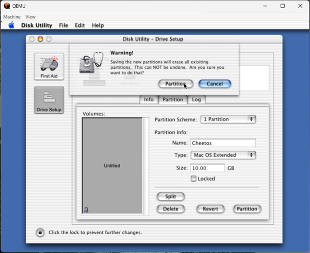
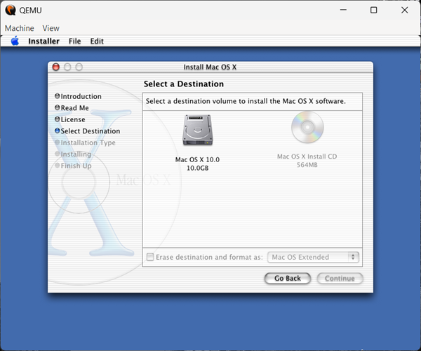
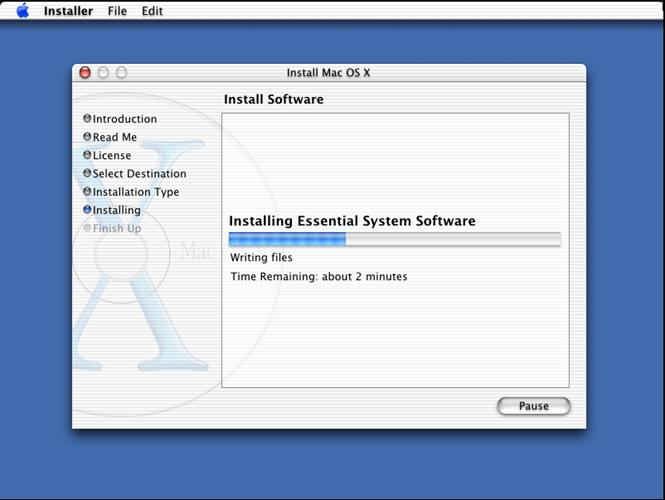
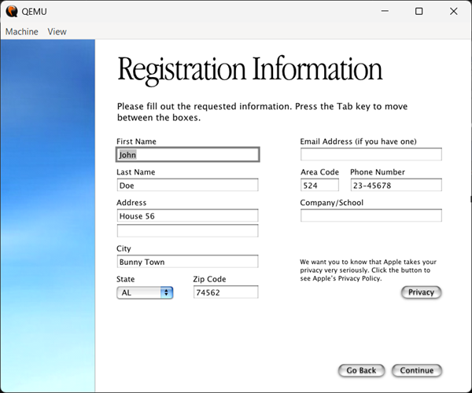
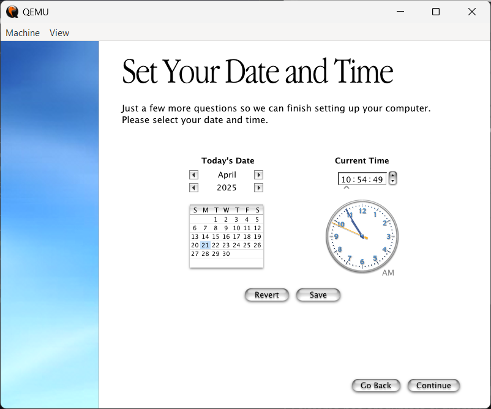

# Virtualización de MacOS X 10.0

Para la evidencia de esta virtualización habremos guardado todos los comando usados en el script en bash: ``cheetah.sh``, que se encuentra en el mismo directorio que este archivo. 
Por simplificación supondremos que la imagen ya se encuentra descargada y todo se hará dentro del directorio __``~/vm``__

#### 1. Creando el disco

Crearemos el disco de 10 GB en el que instalaremos el SO con el comando
    `` qemu-img create -f vmdk ~/vm/Cheetah.vmdk 10G ``
Se recomienda verificar la creción del mismo posteriormente. El tamaño es solo una sugerencia, al igual que el formato que puede ser también __``.vhdx``__.
    
#### 2. Iniciando la máquina virtual
Para este paso se recomienda que la imagen se encuentre en el directorio y procedemos con el comando
    ``qemu-system-ppc -L pc-bios -boot d -cdrom MacOSCheetah.iso -hda Cheetah.vmdk -m 1024``
El 1024 se refiere a la memoria en MB que usará, aunque esto es solo una sugerencia.
#### 3. Booteando
La carga inicial puede ser algo lenta pero luego de unos minutos llegaremos a esta pantalla de selección de idioma (continuaremos con inglés para evitar confusión de terminos).

    

Aquí debemos de hacer click en __Installer__ arriba a la izquierda y seleccionar la opción __Open Disk Utility...__ que nos ayudará a formatear el disco principal.
#### 4. Partición de disco
Una vez tengamos la pantalla para la partición de discos, debemos seleccionar la opción __Drive Setup__ y seleccionamos el disco ``/dev/disk0`` (el disco _vmdk_). Como podemos ver, no hay información de partición así que usamos los siguientes datos:

Una vez hemos hecho esto damos click en __Partition__ y cerramos con el boton rojo para volver al instalador

#### 5. Instalador
Al salir de la partición de discos podemos continuar con la instalación seleccionando el idioma (seguiré usando el inglés por conveniencia), aceptamos la licencia y llegamos a la pantalla de selección de disco de destino.

Al ya tener la partición del disco hecha, solo presionamos en siguiente y dejamos que instale el SO. Posteriormente la computadora se reinicirá por su cuenta.

#### 6. Inicializando el  sistema
Posterior a la instalación debemos de apagar la máquina virtual, pues de la forma que la hemos ejecutado, siempre iniciará desde el disco ISO. Para ello debemos cambiar el comando de ejecución por el siguiente:
    `` qemu-system-ppc -L pc-bios -M mac99 -boot c -hda ~/vm/Cheetah.vmdk``
Al hacer esto iniciaremos dentro del sistema operativo ya instalado. Nos preguntará nuestro país de origen, y configuración de teclado.

Después de esta pantalla nos pedirá llenar algunos formularios sobre uso y otros datos los cuales poco importan si no hay conexión a internet. Subsecuentemente, tendremos que crear una contraseña, aunque es posible continuar sin una si así se desea. 
El sistema nos preguntará si queremos conectar a internet y registrar ahora, los cuales rechazaremos en ambos casos. Después seleccionamos la zona horaria (para El Salvador será _U.S.A. Central_)

Al haber realizado esto, podremos al fin acceder a nuestro sistema operativo.

