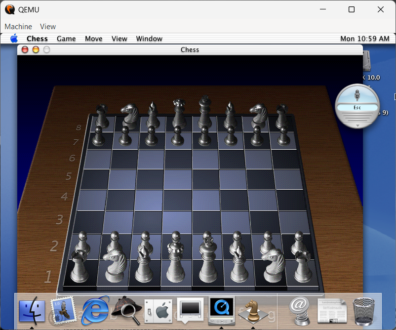
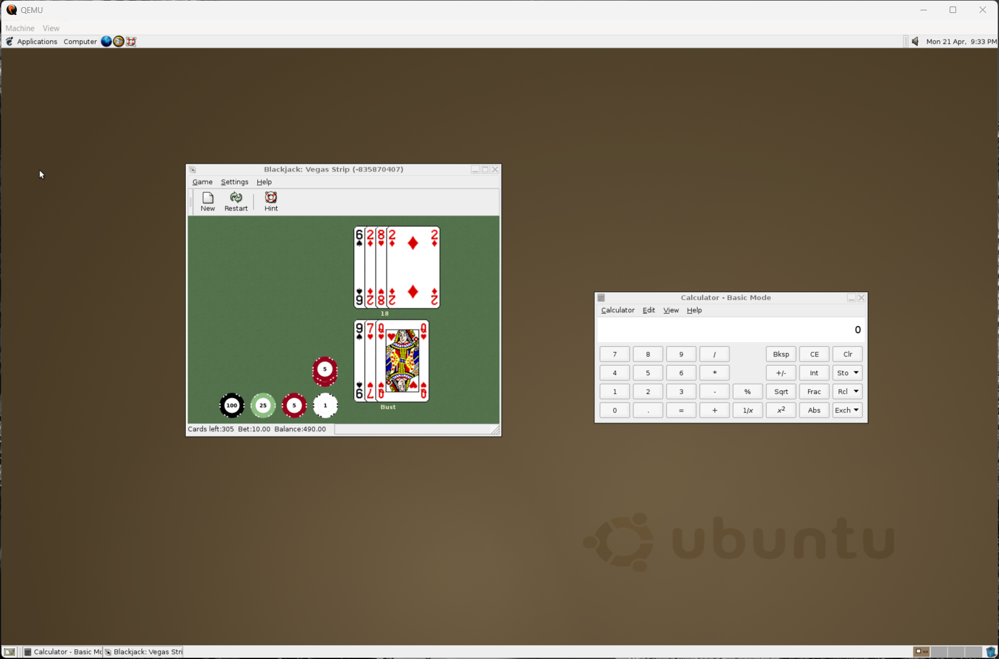

# Practico 3 de laboratorio SIO104L

En este exámen práctico de virtualización se pretendía virtualizar 3 sistemas operativos viejos:
- MacOS X 10.0 (Cheetah)
- Windows 1.0
- Ubuntu 4.1
- Android 1.0

Para cada uno de estos se provee un script para su ejecución, o en su defecto, instrucciones para la virtualización del sistema operativo. La mayoría se realizan dentro del directorio __``~/vm``__ en hosts basados en Linux/GNU o en __``C:\VM``__ para hosts basados en Windows.

## Capítulo I. Hipervisores y Virtualizadores
### QEMU
La virtualización de los sitemas operativos de **MacOS X 10.0, Ubuntu 4.10** se hacen con el uso de __QEMU__. Este puede ser instalarse en Windows <a href='https://www.qemu.org/download/#windows'> a través de la página oficial</a> o desde la terminal con

    iwr -Uri https://qemu.weilnetz.de/w64/qemu-w64-setup-20250416.exe
    && ./qemu-w64-setup-20250416.exe

En el caso de Linux, con el administrador de paquetes de preferencia según la distribución

- Para distribuciones basadas en Debian o Ubuntu

        sudo apt update && sudo apt install qemu-system -y 

- Para distribuciones basadas en Arch

        sudo System -S qemu

- Para distribuciones basadas en SUSE

        zypper install qemu

Al igual que otros hipervisores, una máquina virtual con QEMU requiere de un disco duro virtual, ya sea en formato **.vhdx, .vhd,** o **.vmdk**. A su vez, requiere la inicialización desde un disco o imagen **ISO** para la instalación del sistema operativo.

## Capítulo II. Sistemas Operativos
### MacOS X 10.0 (Chetah)
Para la creación de esta máquina virtual es necesario hacer descargar una imagen ISO del SO. Es posible obtener dicha imagen a través de varios sitios, aunque en este caso lo haremos desde <a href='https://archive.org/details/macos-x-cheetah'>archive.org</a>. 
Para más información de instalación visitar la carpeta MacOS

### Linux Ubuntu 4.10 (Warty Warthog)
Para la creación de esta máquina virtual es necesario hacer descargar una imagen ISO del SO. Es posible obtener dicha imagen a través de varios sitios oficiales y no oficiales. En este caso lo haremos desde <a href='https://old-releases.ubuntu.com/releases/4.10/'>la página oficial</a> de Ubuntu para versiones viejas y usaremos la versión para sistemas en **x86** o **i386**. 
Para más información de instalación visitar la carpeta Ubuntu en este repositorio.

