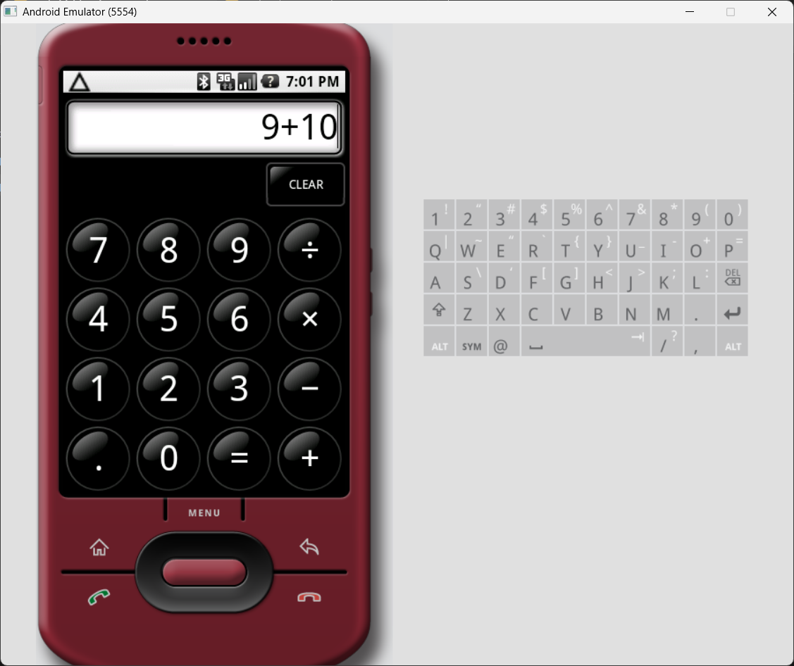

# Practico 3 de laboratorio SIO104L

En este exámen práctico de virtualización se pretendía virtualizar 3 sistemas operativos viejos:
- MacOS X 10.0 (Cheetah)
- Windows 1.0
- Ubuntu 4.1
- Android 1.0

Para cada uno de estos se provee un script para su ejecución, o en su defecto, instrucciones para la virtualización del sistema operativo. La mayoría se realizan dentro del directorio __``~/vm``__ en hosts basados en Linux/GNU o en __``C:\VM``__ para hosts basados en Windows.

## Capítulo I. Hipervisores y Virtualizadores
#### QEMU
La virtualización de los sitemas operativos de **MacOS X 10.0 y Ubuntu 4.10** se hacen con el uso de __QEMU__. Este puede ser instalarse en Windows <a href='https://www.qemu.org/download/#windows'> a través de la página oficial</a> o desde la terminal con

    iwr -Uri https://qemu.weilnetz.de/w64/qemu-w64-setup-20250416.exe
    && ./qemu-w64-setup-20250416.exe

En el caso de Linux, con el administrador de paquetes de preferencia según la distribución

- Para distribuciones basadas en Debian o Ubuntu

        sudo apt update && sudo apt install qemu-system -y 

- Para distribuciones basadas en Arch

        sudo System -S qemu

- Para distribuciones basadas en SUSE

        zypper install qemu

Al igual que otros hipervisores, una máquina virtual con QEMU requiere de un disco duro virtual, ya sea en formato **.vhdx, .vhd,** o **.vmdk**. A su vez, requiere la inicialización desde un disco o imagen **ISO** para la instalación del sistema operativo.

#### PCjs Machines
Esta aplicación web se utiliza para la virtualización de **Windows 1.0**. Es completamente en línea y no requiere más que un navegador con conexión a internet para su uso.

#### Android SDK
El _Software Developmente Kit_ o _SDK_ de Android es una herramienta de código abierto publicada y manejada por Google para el desarrollo de aplicaciones para Android. Este puede encontrarse por medio de los sitios oficiales para desarrolladores o incluida dentro de IDEs como Android Studio.

En nuestro caso es de especial utilidad, pues la versión 1.0 de  _Android SDK_ incluye una máquina virtual de Android 1.0 para computadoras con la cual es posible probar aplicaciones desarrolladas, o en nuestro caso, virtualizar el SO móvil.

## Capítulo II. Sistemas Operativos
### MacOS X 10.0 (Chetah)
Para la creación de esta máquina virtual es necesario hacer descargar una imagen ISO del SO. Es posible obtener dicha imagen a través de varios sitios, aunque en este caso lo haremos desde <a href='https://archive.org/details/macos-x-cheetah'>archive.org</a>. 
Para más información de instalación visitar la carpeta MacOS

### Linux Ubuntu 4.10 (Warty Warthog)
Para la creación de esta máquina virtual es necesario hacer descargar una imagen ISO del SO. Es posible obtener dicha imagen a través de varios sitios oficiales y no oficiales. En este caso lo haremos desde <a href='https://old-releases.ubuntu.com/releases/4.10/'>la página oficial</a> de Ubuntu para versiones viejas y usaremos la versión para sistemas en **x86** o **i386**. 
Para más información de instalación visitar la carpeta Ubuntu en este repositorio.

### Windows 1.0
Por lejos el sistema operativo más viejo de esta lista (16 años de diferencia con el segundo más viejo, MacOS Cheetah) lanzado en 1985. Fue diseñado para una arquitectura muy vieja y mayormente obsoleta hace muchos años por el bien de todos, por lo cual su virtualización es ligeramente más complicada también, pues la mayoría de sistemas operativos modernos no soportan sus archivos de imagen. 
No hay una imagen ISO para este sistema operativo directamente, tan solo archivos tipo **img**, que suelen representar datos de un floppy disk. Por ello, la virtualización será hecha a través del sitio web <a href="www.pcjs.org">**PCjs Machines**</a>. Este sitio permite la emulación de distintos sistemas antiguos.

### Android 1.0
El más joven de los sistemas operativos de esta lista, es un sistema operativo basado en Linux y BSD para teléfonos celulares lanzado en 2008. Para la virtualización de este SO usaremos el SDK 1.0, el cual incluye una máquina virtual de Android 1.0. Dicho SDK, no está disponible ya más de forma oficial, sin embargo, puede obtenerlo por medio de este enlace <a href="https://archive.org/details/android-sdk-1.0_r2"> **de descarga desde archive.org**</a>.

