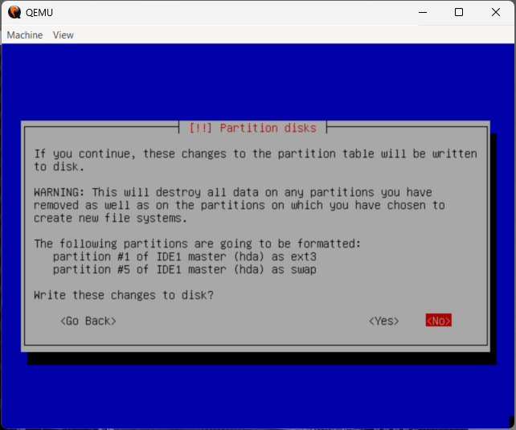

# Virtualización de Ubuntu 4.10
Para la evidencia de esta virtualización habremos guardado todos los comando usados en el script en bash: ``warty.sh`` y ``warty.ps1``, que se encuentra en el mismo directorio que este archivo. 
Por simplificación supondremos que la imagen iso ya se encuentra descargada y todo se hará dentro del directorio __``~/vm``__ o __``C:\VM``__

#### 1. Creando el disco duro virtual

Crearemos el disco de 10 GB en el que instalaremos el SO con el comando

    qemu-img create -f vhdx ~/vm/warty.vmdk 10G

Se recomienda verificar la creción del mismo posteriormente. El tamaño es solo una sugerencia, al igual que el formato que puede ser también __``.vhdx``__.

### 2. Iniciando la máquina virtual
Para comenzar, debido a que esta versión de la ISO que sugerimos en el README principal es para una arquitectura basada en **i386**, debemos de ejecutar el siguiente comando con qemu para emular este arquitectura.

    qemu-system-x86_64.exe -L pc-bios -boot d -cdrom Ubuntu4.10x86.iso -hda warty.vhdx -m 1024

Elegimos usar 1024 MB de memoria, que serán más que suficientes para este SO y boot desde el disco. Al ejecutar el comando veremos la siguiente pantalla donde debemos presionar *ENTER*.

Esperamos a que se inicialicen varios daemons y procesos, para llegar la pantalla de instalación.

### 3. Instalación
Para la instalación debemos primero elegir el idioma de instalación. Por conveniencia elegiremos inglés, aunque el lector es libre de elegir otro (한국어?). Es importante notar que la navegación en este menú se hace por medio del teclado.

En su defecto también podemos acceder a este menú donde podemos visitar distintas páginas del instalador según nos convenga y saltarnos algunos pasos.

Al elegir el idioma, también elegiremos nuestra localización de la lista (notesé la ausencia de Montenegro, Eswatini, y Sudán del Sur de la lista por su edad), y el formato de teclado. En este punto el sistema detectará los componente necesarios de disco y otras dependencias y nos pedirá un nombre para nuestra computadora o host.

También tendremos que elegir el formato de partición del disco. El lector es libre de elegir su formato de preferencia pero por simplificación usaremos el __formato por defecto__.

Una vez aceptamos nuestro destino con la partición por defecto, el sistema comenzará la instalacion del sistema operativo dentro del disco virtual. Al finalizar nos mostrará una pantalla de éxito y apagaremos el sistema.

### 4. Iniciando el sistema
Ya que el sistema está instalado quitaremos la imagen ISO y solo dejaremos el disco duro virtual con el siguiente comando

    qemu-system-x86_64.exe -L pc-bios -boot c -hda warty.vhdx -m 1024

Ahora si, pasamos a nuestro sistema operativo. LLenamos información respecto a hora, localizaión y otros datos que se nos pidan como usuario y contraseña. Al preguntarnos si queremos conectarnos a internet, diremos que no.

