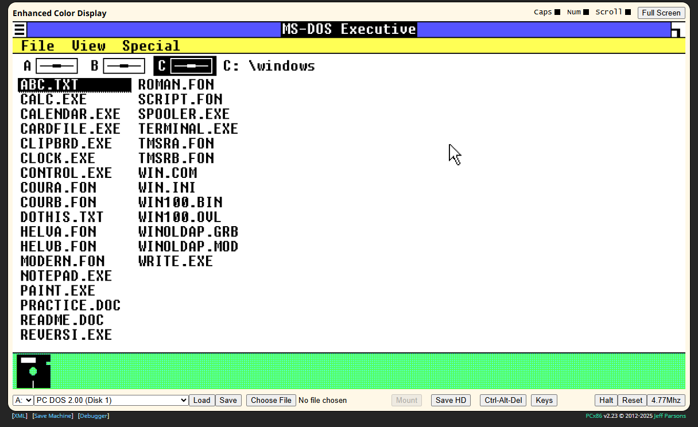

# Virtualización de Windows 1.0

La virtualización de este sistema operativo será hecha completamente en línea a través del sitio web <a href="www.pcjs.org">**PCjs Machines**</a>. Este sitio nos permite emular distintos sistemas antiguos o de bajo recursos desde nuestro navegador.

El enlace de emulación es el siguiente
<a href="https://www.pcjs.org/software/pcx86/sys/windows/1.01/ega/">Windows 1.0 (1985) </a>

La primera imagen que veremos será la siguiente, desde donde podemos elegir entre varios programas, conocidos o no, y probar con ellos. Es posible navegar con el mouse o con el teclado

